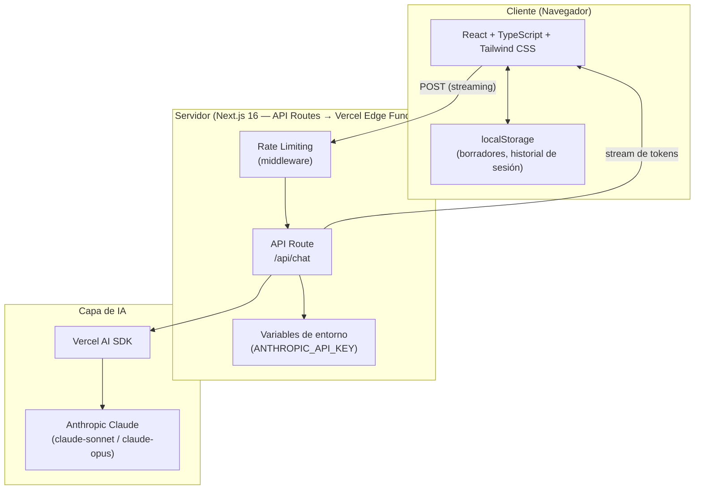
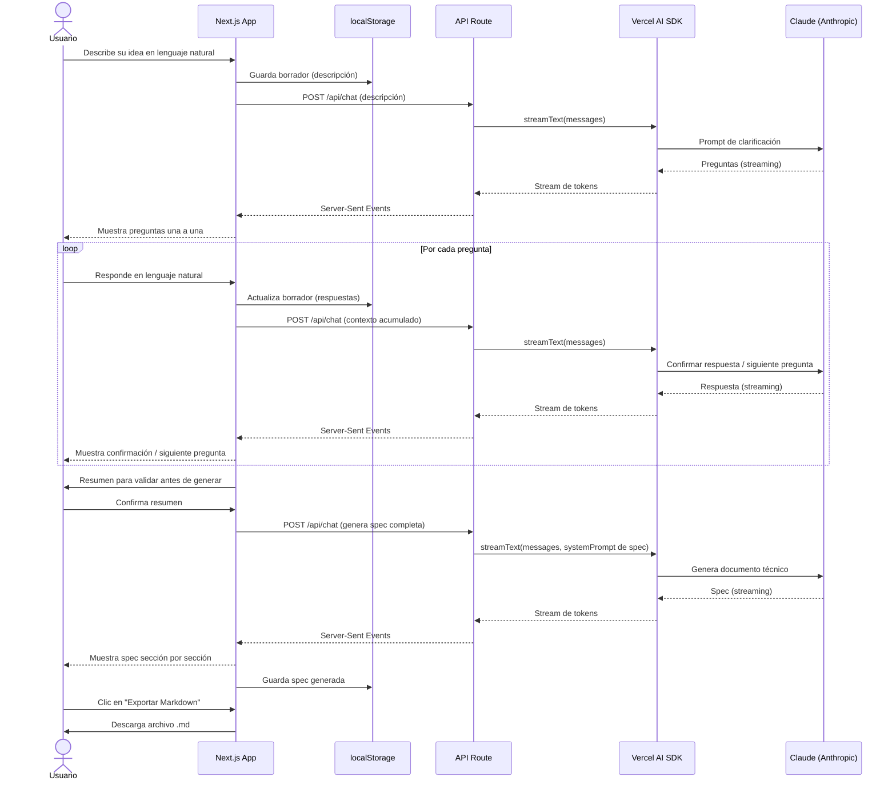
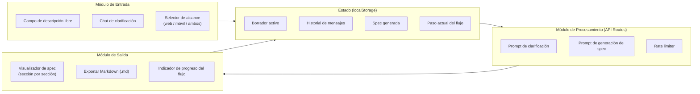
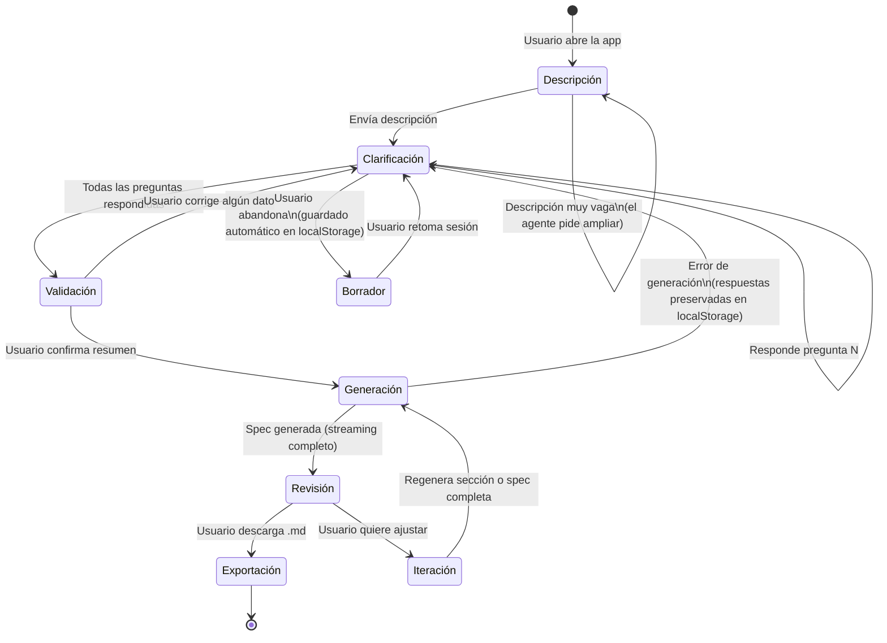

# Agent Specs Builder — Arquitectura y Flujos

## Stack tecnológico



---

## Flujo principal del usuario



---

## Módulos del sistema



---

## Estados del flujo



---

## Estructura de carpetas (Next.js 16)

```
agent-specs-builder/
├── app/
│   ├── page.tsx               # Pantalla principal (chat + spec)
│   ├── layout.tsx
│   └── api/
│       └── chat/
│           └── route.ts       # API Route con Vercel AI SDK + Claude
├── components/
│   ├── ChatInput.tsx          # Campo de descripción + respuestas
│   ├── ChatMessages.tsx       # Historial de mensajes con streaming
│   ├── SpecViewer.tsx         # Visualizador de spec por secciones
│   ├── ProgressIndicator.tsx  # Barra de progreso del flujo
│   └── ExportButton.tsx       # Descarga .md
├── lib/
│   ├── prompts.ts             # System prompts para Claude
│   ├── storage.ts             # Helpers de localStorage
│   └── export.ts              # Generación del archivo Markdown
├── hooks/
│   └── useSpecSession.ts      # Estado global de la sesión
└── .env.local                 # ANTHROPIC_API_KEY (nunca al cliente)
```

---

## Notas de implementación

| Decisión | Detalle |
|---|---|
| Proveedor de IA | Anthropic Claude via Vercel AI SDK (`@ai-sdk/anthropic`) |
| Streaming | `streamText()` del AI SDK → Server-Sent Events al cliente |
| Persistencia | `localStorage` únicamente — sin base de datos en V1 |
| Exportación | Solo Markdown (`.md`) generado en el cliente |
| API Key | Solo en variables de entorno del servidor (`ANTHROPIC_API_KEY`) |
| Rate limiting | Middleware de Next.js en `/api/chat` |
| Despliegue | Vercel (zero-config para Next.js + Edge Functions) |

> **Nota sobre la suscripción Pro de Anthropic:** La API de Claude requiere créditos de API separados de la suscripción Claude.ai Pro. Para el desarrollo puedes usar la API con pago por uso; la suscripción Pro no cubre llamadas de API directas.
